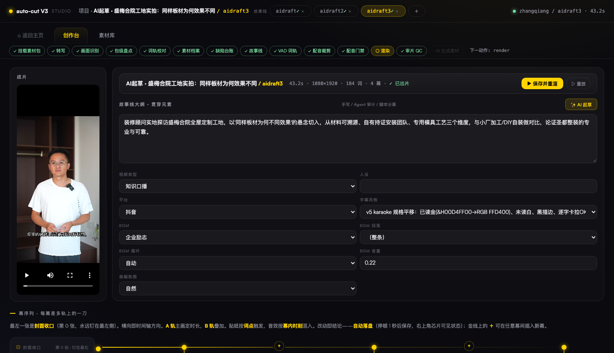
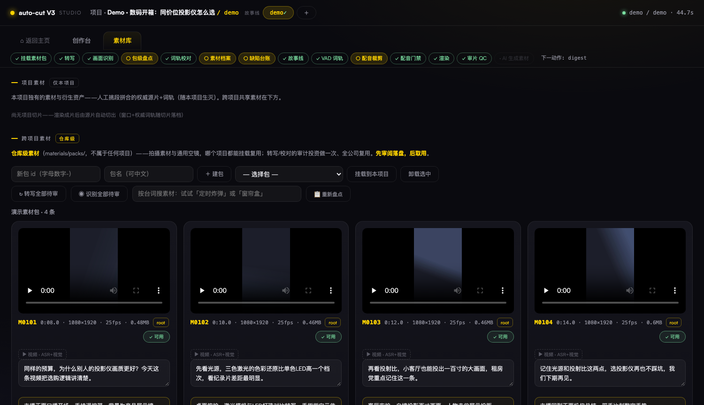

# auto-cut v3 · 口播短视频自动剪辑流水线

[](https://github.com/noah-1106/auto-cut-v3/actions/workflows/ci.yml)
[](LICENSE)
[](https://www.python.org)
[](.)
[](.)
[](https://ffmpeg.org)
[](https://www.minimaxi.com)

**一句话**：把一批手机实拍素材，自动变成一条带卡拉OK字幕、BGM、转场的竖版口播短视频。人（浏览器 Studio）和 Agent（CLI/HTTP）双端同权操作，全程文件传递、每个节点可独立失败。

## 核心亮点：基于"幕"的视频工作台

传统剪辑器（剪映 / Premiere）是**横向时间轴 × N 条轨道**——人在时间轴上反复横跳：对轨、对齐、找剪点，改一处牵一片。auto-cut 换一个抽象：**把成片看成一列"幕"，每一幕 = 所有轨道在同一时间窗上的一刀竖切**——A/B 视频、旁白、字幕、转场、贴纸、音效、音乐，全部收在这一幕的卡片里编辑；时间沿幕序列横向流动，金线上的 ＋ 在任意两幕之间插新幕。

这个抽象换来三件事：

1. **Agent 可编辑**——LLM 起草和修改的是结构化的幕序列 JSON，不是时间轴工程文件；每一幕可独立渲染低清样张自检（秒级），"全片过 ≠ 单幕过"逐幕验证
2. **人可终审**——创作台呈现的是"这条片讲了什么"的一列卡片，不是一坨波形；点任意一幕秒级预览，改动停顿 1 秒自动落盘
3. **管线可自动**——九环节（转写→理解→缺陷台账→AI 起草→配音裁剪→VAD 词轨→渲染→三域门禁→交付）全自动，换一批新素材包冷启动零人工急救

**设计哲学**：Agent 全自动从原始素材到成片；人是规则制定者（改 config 阈值/策略）+ 成片终审，不进流水线当卡点。

---

## 界面速览

**主页**：建项目、效果注册表管理入口，项目卡片直达创作台。


**创作台**：顶部管线进度条（九环节 ✓/○ 实时状态）｜成片监视器｜故事线大纲与全局设定（字幕风格/BGM/段落/封面）｜幕序列金线（横向即时间轴，＋插入新幕，点幕预览秒级低清样张）。


**素材库**：项目切片与仓库级素材包，转写文本就地校对，素材卡带审核徽标（✓ 可用 / ◌ 待审 / ✕ 拍摄废片）与缺陷台账。


---

## 快速上手

### 0. 前置（一次性）
```bash
# ffmpeg 6.0+：mac 放 bin/ffmpeg，Windows 放 bin/ffmpeg.exe，或装进 PATH（libass/libx264 编译项必需）
bin/ffmpeg -version        # 验证（Windows: bin\ffmpeg.exe -version）
```

**云端服务 key**（填 `config/services.json`，已 gitignore 永不入库；`api_key_env` 指向你 shell 里 export 的变量名，或 `api_key_file` 指向一个 `{"api_key":"..."}` 的 key 文件）。各段用途与必需性：

| services.json 段 | 干什么用 | 必需？ | 默认 provider | 免 key 替代 |
|---|---|---|---|---|
| `asr` | 语音转写（词轨原料） | **必需** | minimax | `local-faster-whisper`（本地转写，免 key） |
| `vision` | 画面识别（素材理解/缺陷） | **视频素材必需**（无 key 则视频永不过审、draft 剔除；人可在素材卡手动 toggle 强制过审） | minimax | 无 |
| `llm` | AI 起草故事线 + proofread 校对 | **必需** | minimax | 无 |
| `tts` | dub 配音合成 | dub 幕才需要 | local-audio8（本地，免 key，见 0.5） | 全 original 原声幕可不用 |
| `image` | AI 生成封面 | 可选（封面也可抽帧/上传） | minimax | output-frame/first-frame/beat-frame/upload 四途径 |
| `video` | AI 生成视频素材 | 可选（基本不用） | minimax | 全部实拍素材即可 |

最小可用组合 = ffmpeg + asr/vision/llm 三个 key，跑 original 原声口播全链。
平台支持：macOS 与 Windows 双端（Python 3.10+，零 pip 依赖；本地 TTS 的 onnxruntime venv 是可选组件，见下文"本地 TTS"）。

### 0.5 本地 TTS（Audio8-TTS，可选组件）

默认配音供应商是本地 [Audio8-TTS-Preview-0.6B](https://huggingface.co/Audio8/Audio8-TTS-Preview-0.6B-ONNX-INT4)（Apache 2.0 开源，ONNX INT4 CPU 推理，~1GB 内存）——零 pip 依赖的核心管线不受影响，运行时独立装在 `~/.local/share/autocut3/audio8/`（venv + 模型权重），适配层 `autocut3/tts_audio8.py` 只经 HTTP(127.0.0.1:8024) 通信、服务按需自启。

```bash
# 一次性安装（模型 ~1GB，HF 被墙时脚本走 hf-mirror）：
#   git clone Audio8_TTS 到 ~/.local/share/autocut3/audio8/runtime，
#   python3.12 -m venv ~/.local/share/autocut3/audio8/venv，
#   pip install -r onnx_runtime/requirements.txt + tokenizers（上游漏标），
#   下载 ONNX-INT4 仓库全部 *.onnx(.data) 到 ~/.local/share/autocut3/audio8/model
python3 autocut3/tts_audio8.py status                    # 运行时/服务/音色三态
# 注册参考音色（零样本克隆硬契约：参考音频 0.5-30s + 逐字稿一字不差）
python3 autocut3/tts_audio8.py register <名字> <参考音频.wav> "<逐字稿>"
python3 autocut3/tts.py synth --text "..." --out x.mp3   # provider=local-audio8 走本地
```
换回云端：config/services.json 的 `tts.provider` 改回 `"minimax"`。

### 1. 启动 Studio（人侧）
```bash
python3 studio.py                 # http://127.0.0.1:8765
```

### 2. 全链路走一遍（Agent 侧，与上面等价）
```bash
# ① 建包 + 上传素材（中文文件名 OK；id 自动提取 M 编号）
curl -X POST localhost:8765/api/pack-create/ -d '{"id":"mypack","name":"我的素材"}' -H 'Content-Type: application/json'
curl -X POST "localhost:8765/api/pack-upload/mypack?filename=20260827_M0211.MP4" --data-binary @素材.MP4

# ② 建项目 + 挂载
curl -X POST localhost:8765/api/project-create/ -d '{"name":"myproj","title":"我的项目","format":"vertical"}' -H 'Content-Type: application/json'
curl -X POST localhost:8765/api/pack-mount/myproj/mypack/mount

# ③ 转写 + 画面识别（单素材走 HTTP ?material=M0211；全量走 CLI）
python3 autocut3/transcribe.py myproj
python3 autocut3/understand.py myproj

# ④ AI 起草故事线（读 dossier，产出 storylines/aidraft.json）
curl -X POST localhost:8765/api/draft/myproj -d '{"intent":"数码开箱口播"}' -H 'Content-Type: application/json'

# ⑤ 渲染成片
curl -X POST "localhost:8765/api/render-start/myproj?story=aidraft"
# 产物：projects/myproj/out-aidraft.mp4 + subtitle-aidraft.ass + qc-report.json
```

---

## 管线全景（系统地图）

| # | 环节 | 模块 | 产物 | 下游消费 |
|---|---|---|---|---|
| 1 | 转写 | transcribe.py | pack.json（词轨+文本） | 理解/起草/词轨 |
| 2 | 理解 | understand.py | digest（场景/资产/定位） | 起草 |
| 3 | 缺陷台账 | disposition.py | disposition.json（四类缺陷+建议窗口） | 起草提示词/素材卡⚠ |
| 4 | 起草 | draft.py | storylines/*.json | 渲染 |
| 5 | 裁剪 | dubfit.py | dub 音频+验证报告 | 渲染 |
| 6 | 词轨 | vadwords.py | VAD 词轨 | 字幕/卡拉OK |
| 7 | 渲染 | pipeline.py | out-*.mp4 + subtitle.ass | 门禁/交付 |
| 8 | 门禁 | qc(R1-R10) + dubgate + G1/G2t | qc-report + 门禁报告 | 交付裁决 |
| 9 | 交付 | loudnorm + 发布命名 | 发布成片 | 人终审 |

九个环节全部自动。渲染硬解优先（mac=videotoolbox / win=nvenc·qsv，回退 libx264）；dub 裁剪走"包络定位→掐头掐尾→ASR 闭环"，不过 dubgate 不渲染。

**管线编排器**：`autocut3/orchestrate.py` 从文件推导全部环节状态（含 aigen 预留槽位），人/Agent 同一个入口——
```bash
python3 autocut3/orchestrate.py myproj              # 看状态（✓/○/✗/· + 下一动作）
python3 autocut3/orchestrate.py myproj --advance    # 推进到下一道门（素材段全自动；故事线门需 --intent；mount 是创作决定门）
```
Studio 顶部管线进度条与 `/api/status/<proj>` 同源——Agent 推进，人随时看得见。

**人机契约**：缺陷处置是技术修复决策（判据量化：dup 指纹/能量包络/静音阈值），Agent 按规则全自动执行并留痕，**不设事前人工确认**；人拥有规则制定权（改 config）和成片终审权（可选）。

---

## 注册表（效果系统）

registry/*.json 是人和 Agent 共用的"选什么效果"的唯一事实源。管理入口：首页效果卡片 → 管理抽屉（试听/看图/字幕样张/增删改/导入）。
Agent 起草时读同一张注册表选 BGM/转场/**字幕样式/贴纸/音效**（全部进 draft 提示词，LLM 按幕语义选用，validate 白名单透传）；字幕样式、贴纸、音效按 id 引用。**改注册表即改下一次渲染，无需动代码。**
BGM 条目支持 `segments`（曲内段落：name/in/out/desc）——幕级音乐轨和全局音频都可选用段落，配合 loop 标志做段落循环。
音效=12 槽位社交媒体爆款语义（转场嗖/强调击打/提示叮/悬疑渐强/喜剧弹弓/倒计时/快门/成功短奏/错误蜂鸣/低频轰击/弹出泡泡/尴尬蟋蟀），Mixkit 免费商用，来源与许可存 `assets/sfx/viral/sources-manifest.json` + `LICENSE-mixkit.txt`。
AI 封面图走 image_gen.py（MiniMax image-01，services.json `image` 段）；AI 视频素材走 video_gen.py。

---

## 目录结构

```
studio.py            # 后端全部路由（人/Agent 同权 HTTP）
studio/index.html    # 前端单页（管线进度条/注册表抽屉/渲染实时进度+系统通知）
autocut3/            # 流水线模块：orchestrate(编排器) transcribe(转写) understand(画面)
                     #   draft(AI起草) disposition(缺陷台账) pipeline(成片) video_gen(AI生成口)
                     #   qc(质检R1-R10) proofread(校对) vadwords(VAD词轨) dubfit(配音裁剪) dubgate(配音门禁)
                     #   dossier(素材档案) flock(跨平台锁) tts(配音合成)
registry/            # 注册表：效果系统的单一事实源（*.json 纯数据）
                     #   bgm/subtitles/transitions/sfx/stickers=效果；enums/formats=语义枚举(只读)
assets/              # 效果素材本体（registry 的 file 字段指向这里）
materials/packs/     # 用户素材仓（大文件，不入 git）
projects/<name>/     # 项目工作区：storylines/ 故事线、out-*.mp4 成片、qc-report.json（不入 git，留 .gitkeep 占位）
config/              # services.json(服务key) lexicon.json(校对词表) qc_rules.json
docs/                # 设计文档（pipeline-v2.md=管线自动化改造设计）
tests/               # e2e.py(50项全量) rmw_smoke.py(并发) audit.py(代码审计器)
bin/                 # ffmpeg 6.0+（自备，不入 git）
```

---

## 单节点独立运行

每个模块都能单独跑（输入=文件，输出=文件）：
```bash
python3 autocut3/transcribe.py myproj --material M0211   # 只转写一条
python3 autocut3/understand.py  myproj --material M0211   # 只识别一条
python3 autocut3/vadwords.py    myproj --story main       # VAD 词轨重生成
python3 autocut3/dubfit.py      myproj --story main       # 配音裁剪自动化（dub 幕）
python3 autocut3/dubgate.py     myproj --story main       # 配音裁剪门禁
python3 autocut3/proofread.py   myproj --dry              # 校对预演不落盘
python3 autocut3/pipeline.py    myproj beat 2 main        # 单幕样张（秒级·540p；改幕后自检/人审参考都用它）
python3 tests/e2e.py                                       # 50 项全量回归
python3 tests/audit.py                                     # 代码审计器
```

---

## 常见失败排查

| 症状 | 先看什么 |
|---|---|
| 上传 Broken pipe / 000 | materials/packs/<包>/ 目录是否存在（已自动兜底建）；文件是否 >500MB |
| "bad filename" | 文件名含 `/` `\` `..` 或以 `.` 开头（中文名是允许的） |
| 转写 401/超时 | config/services.json 的 key；minimax 云端限制 ≤50MB/≤500s |
| 渲染卡在 ffmpeg | projects/<proj>/render.status 的 tail 字段有最后 8 行 stderr |
| 字幕不换页/叠字 | subtitle-*.ass 是否生成；words 词轨是否为空（转写失败会让字幕静默消失） |
| 字幕与语音错位 | 词轨来源是否 VAD（narration.words）；素材词轨平移方案已废弃（时间戳漂移） |
| 配音开头有残留杂音 | dubgate 是否跑过；音频是否掐头（按能量包络 0.1s 级定位，不信 ASR 词轨） |
| 改了代码不生效 | **studio.py 是常驻进程，改完必须重启**（两次"改了没生效"都是模块缓存） |

---

## 测试与质量

```bash
python3 tests/e2e.py      # 50 项端到端（上传/起草/渲染/并发/安全），ALL GREEN 是交付底线
                          # 加 --fast 跳过 LLM/ASR/TTS 真实计费项（48 项离线，日常回归用这个）
python3 tests/audit.py    # 七维审计：路由安全/数据断链/JS函数对照/文档时效/git卫生
python3 tests/rmw_smoke.py# 读-改-写并发原子性
```
每次 push 到 main，GitHub Actions 在 windows-latest + ubuntu-latest 双端跑全量 e2e（含真实云端 LLM/ASR/TTS 冒烟，key 走 repository secret）。

---

## 工程铁律（踩坑提炼，贡献者/Agent 动手前必读——违反=事故重演）

1. **ASR 词级时间戳是推测值**（素材间漂移 0~3s、同一音频内不均匀）——禁止直接作裁剪锚/字幕时间源；时间源=vadwords.py 的 VAD 物理测量（silencedetect 语音段）
2. **词轨黑区**：拍摄口令/嘟囔 ASR 会漏转写——按"能量有语音、词轨无文本"检测并掐除（事故：口令"三二一走"进成片）
3. **concat 拼接必占位**：跳过的区间（静音洞等）必须补等长静音段，否则后段整体前移（事故：片尾提前 4s 无 BGM）
4. **序列化保真**：前端落盘必须透传未知字段——白名单重建=静默丢数据（事故：手工词轨全丢，字幕退化均分）
5. **dub 裁剪闭环**：裁出音频必须 dubgate 复检（首词=story 首字 / 末词含句尾 / 相似≥0.9），不过闸不渲染
6. **门禁三域**：文本域（G1 说了什么）+ 时间域（G2t 什么时候说的）+ 听觉域（响度/静音洞）——"文本对"≠"时间对"（事故：46% 字符错位>1s 照样过文本门禁）
7. **修复闭环**：修 A 暴露 B 是常态，门禁复跑到全绿才算收敛；修复必须带回归锚进 tests/e2e.py，没锚=没修完
8. **跨平台纪律（Mac/Windows）**：文件锁一律走 `autocut3/flock.py`（POSIX=flock / Windows=msvcrt，禁直接 import fcntl）；ffmpeg 解析走 `ffmpeg_path()`（env → bin/ffmpeg(.exe) → PATH，禁裸 `"bin/ffmpeg"` 相对路径）；渲染编码走 `hw_encoder()`（平台探测，软编 libx264 只做回退）
9. **滤镜串内嵌路径=相对路径+无引号**（Windows CI 实锤）：ffmpeg 7+ 新解析器把选项值里的盘符冒号（`D:`）当选项分隔符——引号/转义/正斜杠化都救不了；只有值内零特殊字符才稳（`-filter_complex` 里的路径一律 `os.path.relpath(p, ROOT)`，subprocess 统一 `cwd=ROOT`，现成实现 `pipeline._ass_spec()`；argv 里的 `-i` 路径不受此限）

---

## 已知边界

- 本地 TTS（Audio8-TTS，Apache 2.0）音色库按需扩充（默认 narrator_default 一个）
- dub 配音成片响度可能偏轻（R6 warn 不拦交付，平台会自行归一，终审核对混音比例）

## 更多文档

- 管线自动化改造设计：`docs/pipeline-v2.md`
- 素材音效的第三方许可：`assets/sfx/viral/LICENSE-mixkit.txt`

## 贡献

欢迎 Issue 和 PR。提交前请跑 `python3 tests/e2e.py --fast`（48 项离线回归）确保全绿；涉及渲染链的改动请在 macOS 和 Windows 双侧验证（或依赖 CI 双端矩阵）。
